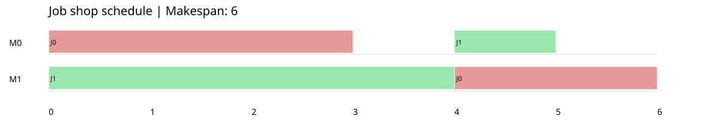
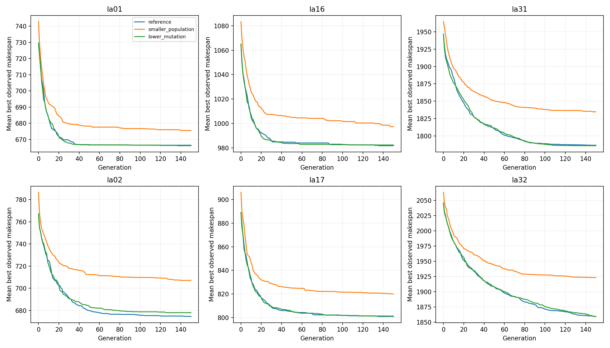

# ACIT4610 Assignment 1: Job Shop Scheduling with a GA

A genetic algorithm (GA) schedules job operations to minimize **makespan**: the time
when the last operation finishes. Group number: **Group-8**, Group members: **Zhongye Xue, Syed Mohammad Abdur-Rahman Tirmizey, Jakob Andreas Amtedal, Khoa Anh Huynh**.

## 1. How the next generation is created

Example: `la01`, population **4**, **10 generations**, crossover probability **0.9**,
mutation probability **0.2**, tournament size **2**, and random seed **42**.

```text
Read la01: 10 jobs, 5 machines
    |
    v
Generate 4 chromosomes (50 genes each)
    |
    v
SBA builds 4 schedules and calculates 4 makespans
    |
    v
Start one generation update
    |-- Create an empty next population []
    |-- Select 2 parents -> crossover -> mutation -> add 2 children
    |-- Select 2 parents again -> crossover -> mutation -> add 2 children
    |-- The next population now contains 4 individuals
    |-- Calculate the makespan of each new individual
    |-- Replace the entire old population with the new population
    |
    v
Repeat until 10 generation updates are complete
    |
    v
Report the last-generation best and export the best schedule found during the run
```

Each individual is a complete solution. Parents are always selected from the old
population and can be selected again. Two rounds of reproduction fill four places.
**No elite is automatically retained.** The best solution seen during the run is
recorded for output only; it does not enter the next population.

## 2. Algorithm design

| Block | Implementation |
| --- | --- |
| Encoding | A gene is a job ID. Its kth occurrence selects that job's kth operation. In la01, IDs 0–9 each occur five times. |
| Initialization | Independently shuffle valid chromosomes. Population size determines how many candidates are maintained. |
| Selection | Sample two individuals and select the smaller makespan. Repeat to select the second parent. |
| Crossover | With probability `pc` per pair, keep half the job IDs at one parent's positions and fill gaps in the other parent's order. Reverse roles for the second child. Otherwise copy the parents. |
| Mutation | With probability `pm` per child, swap two positions containing different job IDs. |
| Replacement | Fill an empty population with children and replace all old individuals. |
| Termination | Stop after the specified number of generations. |

Crossover and mutation preserve the number of operations for every job. Identical
chromosomes reuse their score within a run to avoid unnecessary decoding.

### SBA: build a feasible schedule

Experiments use **idle-gap insertion**:

```text
Read a gene -> find the job's next operation, machine, and duration
    -> start searching from the previous operation's finish time
    -> scan the machine's occupied intervals for the earliest gap that fits
    -> record start/finish and update job progress and machine intervals
    -> repeat for the next gene
```

This preserves operation order and prevents machine overlap. The score is the maximum
finish time, so **lower is better**. Returned schedules are independently validated.
The optional `append` decoder uses `start = max(job_ready, machine_last_finish)`.

Example: job 0 needs M0 for 3 time units, then M1 for 2; job 1 needs M1 for 4, then
M0 for 1. Decode chromosome `[0, 1, 0, 1]` with zero-based IDs:

| Step | Job | Operation | Machine | Start | Finish |
| ---: | ---: | ---: | ---: | ---: | ---: |
| 1 | 0 | 0 | 0 | 0 | 3 |
| 2 | 1 | 0 | 1 | 0 | 4 |
| 3 | 0 | 1 | 1 | 4 | 6 |
| 4 | 1 | 1 | 0 | 4 | 5 |

Makespan = **6**. Operations on different machines can run simultaneously.



## 3. Instances and experiment parameters

| Category | Instances | Jobs × machines |
| --- | --- | --- |
| Small | la01, la02 | 10 × 5 |
| Medium | la16, la17 | 10 × 10 |
| Large | la31, la32 | 30 × 10 |

The files are bundled in `data/lawrence`; see [data source and license](data/README.md).

| Parameter set | Population | Generations | Crossover | Mutation |
| --- | ---: | ---: | ---: | ---: |
| reference | 50 | 150 | 0.8 | 0.1 |
| smaller_population | 20 | 150 | 0.8 | 0.1 |
| lower_mutation | 50 | 150 | 0.8 | 0.05 |

`configs/experiments.json` defines these settings. All use insertion SBA, tournament
size 2, and seeds 0–29: **6 instances × 3 sets × 30 independent restarts = 540 runs**.
The comparisons isolate population size and mutation probability. Crossover and
generation count are fixed, so their independent effects are not tested.

## 4. Results and evaluation

The completed 540-run results are in `results/final`:



Columns show small (la01/la02), medium (la16/la17), and large (la31/la32) instances.

| Output | Purpose |
| --- | --- |
| [summary.csv](results/final/summary.csv) | All 18 comparisons: best, worst, mean, standard deviation, timing, convergence, and gap |
| [runtime_table.csv](results/final/runtime_table.csv) | Mean runtime for each instance and parameter set |
| [convergence.png](results/final/convergence.png) | Mean best-so-far makespan over generations |
| [quality_comparison.png](results/final/quality_comparison.png) | Mean gap with sample-standard-deviation error bars |
| [runs.csv](results/final/runs.csv) | Individual measurements, settings, and seeds |
| `INSTANCE/SET/best/` | Best chromosome, schedule table, history, and Gantt chart |

- **Quality:** compare run-best makespans. Lower mean is better; lower sample standard
  deviation (n − 1) means greater consistency. Worst is the worst observed run.
- **Across instances:** use `Gap (%) = 100 × (makespan / reference optimum − 1)`.
- **Efficiency:** compare execution time together with quality. Timing covers GA
  initialization and search, excluding data loading and output; teaching prints are off.
- **Convergence:** record the last generation improving the historical best, or 0 if
  initialization found it. This is not proof that further improvement is impossible.
- **Early/late behavior:** compare improvement in generations 0–37 and 112–150.
  The last-generation best is also saved to show whether a good solution was lost.

## 5. Reproduce the project

Use Python 3.10 or newer. From the repository root:

```bash
python3 -m venv .venv
source .venv/bin/activate
python -m pip install -r requirements.txt
python -m unittest discover -s tests -v

# Learn with four individuals and key prints
python -m jssp --instance la01 --population-size 4 --generations 10 --crossover 0.9 --mutation 0.2 --decoder append --verbose --output results/learning

# Generate the worked decoding example
python -m jssp --example

# Run la01 with the reference settings
python -m jssp --instance la01 --seed 42 --output results/la01

# Repeat all 540 experiments in a fresh directory
python -m jssp --experiments --output results/reproduction
```

On Windows, activate with `.venv\Scripts\Activate.ps1`. A single run exports
`solution.json`, `schedule.csv`, `history.csv`, `gantt.svg`, and `convergence.png`.
Use a fresh directory for each batch; `manifest.json` records settings and completion.
The same seed reproduces the search results, not exact execution times.

Code is organized into `data.py` (reading), `decoder.py` (SBA), `generational_ga.py`
(GA), `experiments.py` (repeated runs), and `output.py` (tables/figures), under `jssp/`.

The group separately provides the 1000–1500-word PDF report, Canvas group number,
GitHub link, and submission. This README documents the code and reproduction steps.
